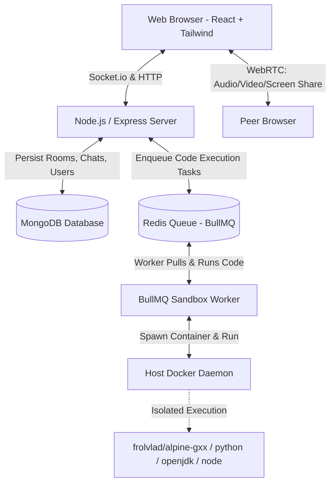

# 🌉 CodeBridge

CodeBridge is a production-ready, real-time technical interview platform that simulates real-world coding assessment environments. It integrates live collaborative coding, interactive audio/video calls, secure sandboxed code execution, proctoring/anti-cheat monitors, and persistent chat communication.

---

## 🚀 Key Features

*   **👥 Real-Time Collaborative Editor**: Full-featured IDE powered by Monaco Editor. Synchronizes code, cursors, editor themes, and active programming languages (C++, Python, Java, and JavaScript) in real-time across participants.
*   **🧑‍💻 Solo Practice Mode**: Dedicated standalone practice environment allowing candidates to solve algorithmic challenges independently without requiring an active interviewer room.
*   **🎥 WebRTC Video/Audio & Screen Sharing**: Built-in peer-to-peer communication using `simple-peer` and Socket.io signaling. Conduct face-to-face evaluations and watch candidates share their screens without external meeting software.
*   **🔒 Secure, Sandboxed Code Execution**: Run and submit code against customizable test suites. Features dual-mode execution: isolated, resource-bounded Docker containers (256MB RAM cap, CPU limit, disabled network, read-only FS) and native Linux compiler sandboxing with kernel signal timeout watchdogs.
*   **🚨 Anti-Cheat & Proctoring Engine**: Monitors focus changes and page visibility. Automatically triggers visual warnings on the candidate's screen and notifies the interviewer in real-time if a candidate exits fullscreen or switches tabs.
*   **💬 In-Room Chat**: Integrated messaging system allowing instant text communication during the session. Chat history is synchronized in real-time and persisted inside MongoDB.
*   **📊 Room & Question Management**: Interviewer dashboard to create rooms, select custom problems, import from a curated question bank, manage test cases (input/output), track live submission histories, and configure session parameters.

---

## 🏗️ System Architecture



---

## 🛠️ Tech Stack

### Frontend
*   **Framework & Build Tool**: React 19 + Vite
*   **Styling**: Tailwind CSS v4
*   **Editor Integration**: `@monaco-editor/react`
*   **Real-time & Signaling**: `socket.io-client` & `simple-peer`
*   **Routing**: `react-router-dom` v7

### Backend & Infrastructure
*   **Runtime**: Node.js & Express
*   **Database**: MongoDB & Mongoose
*   **Job Queue**: Redis & BullMQ (for handling code execution asynchronously)
*   **Sandbox**: Docker API & Docker CLI via child processes
*   **Auth**: JSON Web Tokens (JWT) & Cookie-based sessions

---

## 📦 Installation & Setup

### Prerequisites
Make sure you have the following installed on your machine:
*   [Node.js](https://nodejs.org/) (v18.x or above)
*   [Docker](https://www.docker.com/) (Must be running for sandboxed code execution)
*   [MongoDB](https://www.mongodb.com/) (Local instance or Atlas connection string)
*   [Redis](https://redis.io/) (Used for the code execution job queue)

---

### Step 1: Clone the Repository
```bash
git clone https://github.com/avadhesh11/CodeBridge.git
cd CodeBridge
```

---

### Step 2: Configure Environment Variables

Create a `.env` file in both the `server` and `Frontend` directories based on the templates below:

#### Backend Environment Variables
Create `server/.env`:
```env
PORT=5000
MONGO_URI=mongodb://127.0.0.1:27017/codebridge
REDIS_URL=redis://127.0.0.1:6379
ACCESS_SECRET=your_jwt_access_secret_key
REFRESH_SECRET=your_jwt_refresh_secret_key
FRONTEND_URL=http://localhost:5173
TEMP_VOLUME_NAME=codebridge_temp_data

# GitHub OAuth credentials
GITHUB_CLIENT_ID=your_github_client_id
GITHUB_CLIENT_SECRET=your_github_client_secret
BACKEND_URL=http://localhost:5000
```

#### Frontend Environment Variables
Create `Frontend/.env`:
```env
VITE_BACKEND_URL=http://localhost:5000
VITE_FRONTEND_URL=http://localhost:5173
```

---

### Step 3: Run the Application

#### Option A: Using Docker Compose (Recommended)
Docker Compose spins up all services (MongoDB, Redis, Node Backend, and React Frontend) and automatically configures volume sharing.

To support compilation and sandbox execution inside Docker, the backend container mounts `/var/run/docker.sock` to control host-level Docker processes.

1. Start all containers:
   ```bash
   docker-compose up --build
   ```
2. Access the application:
   *   **Frontend**: `http://localhost:3000`
   *   **Backend Server**: `http://localhost:5000`

#### Option B: Running Locally (Manual Setup)
If running outside of Docker Compose, ensure your local MongoDB and Redis servers are running, then proceed as follows:

1.  **Start the Backend Server**:
    ```bash
    cd server
    npm install
    npm start
    ```
2.  **Start the Frontend Client**:
    ```bash
    cd Frontend
    npm install
    npm run dev
    ```
3.  Access the application:
    *   **Frontend Client**: `http://localhost:5173`
    *   **Backend API**: `http://localhost:5000`

---

## 🗂️ Project Structure

```text
CodeBridge/
├── Frontend/                 # React Client Application
│   ├── src/
│   │   ├── components/      # UI components (Editor, VideoPanel, Chat)
│   │   ├── pages/           # Layout views (Home, Login, Dashboard, Interview, Profile)
│   │   ├── context/         # Auth and Context providers
│   │   └── utils/           # APIs and helpers
│   ├── Dockerfile
│   └── nginx.conf            # Nginx config for frontend production serve
├── server/                   # Express Backend Application
│   ├── src/
│   │   ├── config/          # Configurations
│   │   ├── middleware/      # Authentication, Error handling
│   │   ├── models/          # Mongoose Schemas (User, Room, Question, Chats)
│   │   ├── modules/         # Controller/Route layers (Auth, Room, Questions)
│   │   ├── services/        # Business Logic & Docker execution engines
│   │   └── sockets/         # Socket.io connection & collaboration events
│   ├── Dockerfile
│   └── server.js            # Entry Point
├── docker-compose.yml        # Orchestration configurations
└── README.md
```

---

## 🔌 API Reference

### 🔐 Authentication Module (`/api/auth`)
| Method | Endpoint | Description | Auth Required |
| :--- | :--- | :--- | :---: |
| `POST` | `/api/auth/signup` | Create a new user profile | No |
| `POST` | `/api/auth/login` | Login user, receives Access & Refresh tokens | No |
| `POST` | `/api/auth/refresh` | Re-issue Access Token using Refresh Token cookie | No |
| `PUT` | `/api/auth/profile` | Update user metadata (bio, skills, etc.) | Yes |

### 🔑 Room Module (`/api/room`)
| Method | Endpoint | Description | Auth Required |
| :--- | :--- | :--- | :---: |
| `POST` | `/api/room/new` | Instantiate a new collaborative interview session | Yes |
| `POST` | `/api/room/codeTest` | Run sample test cases for a coding question | Yes |
| `POST` | `/api/room/close/:roomID` | End session and archive active progress | Yes |
| `GET` | `/api/room/user/all` | List all historical rooms for the logged-in user | Yes |
| `GET` | `/api/room/questions/:roomID` | Fetch active coding questions selected for the room | Yes |
| `GET` | `/api/room/:roomID` | Retrieve details, status, and config of a room | Yes |

### 📝 Questions Module (`/api/question`)
| Method | Endpoint | Description | Auth Required |
| :--- | :--- | :--- | :---: |
| `POST` | `/api/question/add/:roomId` | Add a new coding question (Public or Private) | Yes |
| `GET` | `/api/question/public` | Fetch all public questions | No |
| `GET` | `/api/question/public/:roomId` | Fetch public questions added for a room | No |
| `GET` | `/api/question/private/:roomId` | Fetch private questions associated with the user/room | Yes |
| `GET` | `/api/question/:id` | Fetch details of a single question | No |
| `DELETE` | `/api/question/:id` | Delete a custom question | Yes |

---

## ⚡ Socket.io Collaboration Events

Communication inside the `Interview` room relies heavily on real-time event exchanges:

*   `join-room`: Sent by participants upon entering. Verifies permissions and initial room configuration.
*   `code-change` / `code-update`: Transmits real-time code modifications in the Monaco editor.
*   `language-change` / `language-update`: Synchronizes active programming languages.
*   `chat`: Facilitates text message exchanges inside the room workspace.
*   `select-question`: Allows the interviewer to push a selected coding challenge to the active workspace.
*   `webrtc-offer` / `webrtc-answer` / `webrtc-ice`: Mediates signaling for video/audio and screen sharing.
*   `candidate-left-fullscreen`: Dispatched automatically by the browser when the candidate navigates away. Alerts the interviewer interface.
*   `interviewer-warn-candidate`: Triggers an on-screen modal alert on the candidate's workspace.
*   `end-session`: Closes the interview room and locks down coding access.

---

## 🛡️ Sandbox Security Architecture

To prevent malicious system scripts (such as file-system modification or resource exhaustion), all code execution runs inside isolated Docker containers:

1.  **Isolation**: The execution process has no access to the host machine.
2.  **Resource Constraints**:
    *   `--memory=256m`: Caps the RAM at 256MB to avoid memory leak attacks.
    *   `--cpus=1`: Caps CPU utilization to prevent infinite loop locking.
    *   `--pids-limit=64`: Blocks fork bomb scripts.
3.  **Network Isolation**: `--network=none` prevents network requests (disabling unauthorized data extraction).
4.  **Read-Only File System**: Container filesystems are mounted read-only, with temporary files written only to standard RAM `/tmp` directories (`--tmpfs /tmp`).
5.  **Execution Deadlines**: Uses a timeout guard (`timeout 2s`) to terminate processes taking too long (verdict `TLE`).
